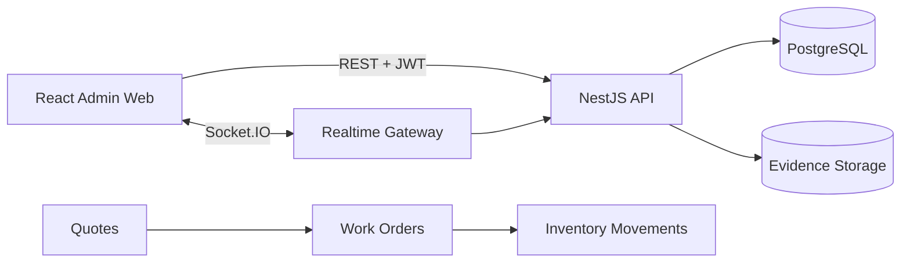

# GarageFlow — Architecture Notes

## Enfoque

GarageFlow mantiene un **modular monolith**. Para el tamaño actual es preferible a dividir prematuramente el dominio en microservicios: conserva transacciones locales, despliegue simple y límites de módulo claros.

## Vista de componentes

## Módulos y límites

- `auth`: identidad, sesiones y autorización.
- `users`: personal y roles.
- `clients`: información del cliente.
- `vehicles`: activo del cliente atendido por el taller.
- `catalog`: productos, servicios y stock.
- `quotes`: propuesta económica inmutable a nivel de snapshot de ítems.
- `work-orders`: ejecución del trabajo aprobado.
- `media`: evidencias de la ejecución.
- `realtime`: publicación de cambios operativos.

## Decisiones relevantes

### Cotizaciones usan snapshot
El nombre, SKU, tipo y precio del catálogo se copian al `QuoteItem`. Un cambio futuro en el catálogo no modifica una cotización histórica.

### Inventario es transaccional
Los ajustes adquieren un bloqueo pesimista sobre el producto y escriben el nuevo stock y su movimiento dentro de la misma transacción.

### Refresh token opaco
El access token es JWT de corta duración. El refresh token es aleatorio y la base sólo guarda su hash SHA-256. Cada refresh revoca el token usado y entrega uno nuevo.

### Orden desde cotización es idempotente
`quoteId` es único en `work_orders`. Repetir la operación devuelve la orden existente en lugar de duplicarla.

### Consumo de materiales es idempotente
La orden registra `stockConsumedAt`. El descuento de productos y los movimientos de inventario se ejecutan en una sola transacción y sólo una vez por orden.

### Estados explícitos
Las cotizaciones y órdenes sólo pueden recorrer transiciones permitidas. Esto evita saltos como `received -> delivered`.

## Futuro

Si el sistema crece, candidatos razonables para separación son notificaciones, procesamiento de documentos/media y reporting. El núcleo transaccional de clientes/cotizaciones/órdenes/inventario debe permanecer junto mientras sus invariantes requieran transacciones consistentes.
